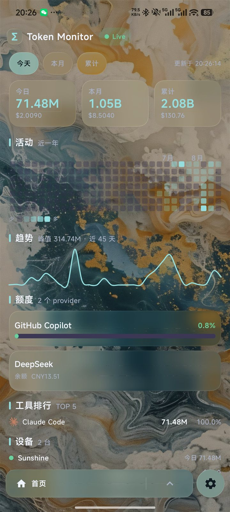
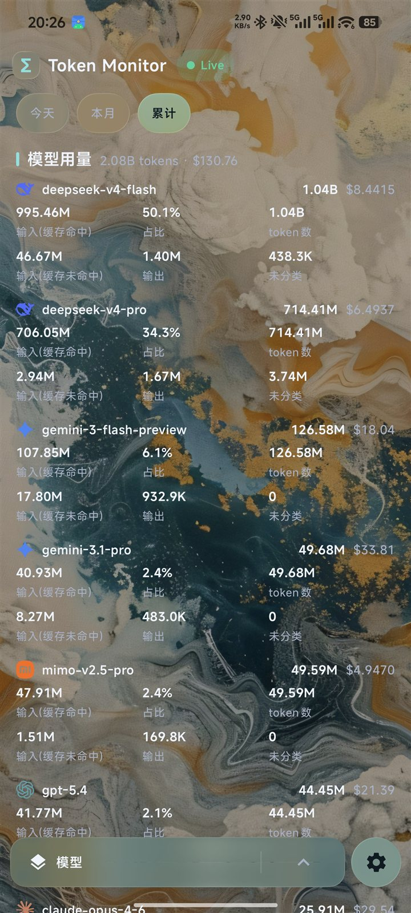

# Token Monitor Mobile

<p align="center">
  
</p>

原生 Android 客户端,参照 [Token Monitor](https://github.com/Javis603/token-monitor) 桌面端界面,从自建 Token Monitor hub(Cloudflare Worker / Node)拉取聚合数据,只读展示。

极光渐变背景 + Liquid Glass 玻璃质感:统计卡、周期按钮、导航胶囊、设置项全部使用磨砂玻璃面板,直接渲染 SVG 工具图标。

## 截图

| 首页 | 模型页 |
|---|---|
|  |  |

## 技术栈

| 层 | 技术 |
|---|---|
| 语言 | **Kotlin 2.3** |
| UI | **Jetpack Compose (Material 3)**,Compose BOM 2026.02.00 |
| 视觉 | **Liquid Glass**([AndroidLiquidGlass](https://github.com/Kyant0/AndroidLiquidGlass),Apache-2.0):玻璃卡片、动态极光背景、磨砂芯片/按钮 |
| 图标 | **SVG 直用**([androidsvg](https://github.com/BigBadaboom/androidsvg)):token-monitor 的 38 个品牌 SVG 放于 `assets/icons/`,运行时渲染并着色 |
| 网络 | **OkHttp 4** + **kotlinx.serialization**(容错解析,旧 hub 兼容) |
| 异步 | **协程 / Flow**(ViewModel 状态驱动) |
| 数据 | hub HTTP API(`GET /api/stats`,Bearer 鉴权) |
| 最低系统 | **Android 8.0 (API 26)**(玻璃效果在 Android 12+ 全开,低版本自动降级) |

## 界面

底部为视图切换胶囊:左侧点击循环切换视图,右侧弹出上拉选择框。共 8 个视图 + 设置:

| 视图 | 内容 |
|---|---|
| 首页 | 今日/本月/累计统计卡、GitHub 风格活动热力图、趋势面积图、工具排行、额度、设备 |
| 工具 | 按工具分解:品牌 logo、tokens、费用、缓存命中/未命中、输出、占比 |
| 模型 | 按模型分解:模型 logo、tokens、费用、输入(缓存命中/未命中)、输出、未分类 |
| 项目 | 按工作区项目聚合:tokens、费用、客户端占比 |
| 会话 | 会话级用量:项目、客户端、tokens、费用、消息数 |
| 趋势 | 历史趋势:近 45 天面积图、峰值、最近记录 |
| 额度 | AI Tool Limits:provider 账号、会话/周/账单/余额窗口、用量进度条、重置时间 |
| 设备 | 每台设备用量与同步状态,stale 设备置灰 |
| 设置 | Hub URL、Secret(必填)、刷新间隔、货币、背景、深浅色、关于 |

## 构建

前置:JDK 17+、Android SDK(compileSdk 36 / build-tools 36+)。

```bash
# Windows
set GRADLE_USER_HOME=%CD%\.gradle-home
gradle :app:assembleDebug
# APK 输出: app/build/outputs/apk/debug/app-debug.apk
```

首次构建会从 Google Maven 下载依赖;仓库的 `settings.gradle.kts` 已配置阿里云镜像加速。

```bash
# 运行单元测试(数据解析,不依赖设备)
gradle :app:testDebugUnitTest
```

安装:`adb install app/build/outputs/apk/debug/app-debug.apk`

## 使用

1. 打开应用 → 点击右上角齿轮 → 设置
2. 填写 Hub URL(如 `https://hub.example.com`)和 Secret(必填)
3. 点「测试连接」验证 → 「保存并应用」
4. 首页出现 Live 徽标即成功

> Secret 为必填项,用于 Bearer 鉴权访问 `/api/stats`。

首次成功拉取后应用会缓存数据,下次启动即使 hub 不可达也能看到上次的数据与活动热力图。

## 数据流

```
桌面端 widget / headless agent ──POST──▶ hub(Cloudflare Worker/Node)──GET /api/stats──▶ 本应用
```

本应用只读 hub 的聚合结果,不做本地采集。

## 与桌面端的对应关系

| 桌面端 | 本应用 |
|---|---|
| `src/electron/renderer`(HTML/JS) | `app/src/main/java/com/tokenmonitor/mobile/ui/` |
| `src/shared/compactTokens.js` | `util/Format.kt` `compactTokens()` |
| `src/shared/compactMoney.js` | `util/Format.kt` `formatMoney()` |
| `usageCharts.js` `clientColors` / `modelVendorFor` | `util/Format.kt` `VENDOR_COLORS` / `vendorForModel()` |
| hub `docs/API.md` wire shape | `data/Models.kt`(kotlinx.serialization) |
| `assets/icons/*.svg` 品牌图标 | `app/src/main/assets/icons/`(androidsvg 直用) |

## 第三方依赖

- `io.github.kyant0:backdrop` 1.0.6 + `io.github.kyant0:shapes` 1.2.0 — [AndroidLiquidGlass](https://github.com/Kyant0/AndroidLiquidGlass) 的 Liquid Glass 效果库,Apache-2.0
- `com.caverock:androidsvg` 1.4 — SVG 渲染(Apache-2.0)
- 要求 compileSdk ≥ 36(Kotlin 2.3.10 / Compose BOM 2026.02.00 / ui 1.10.3)
